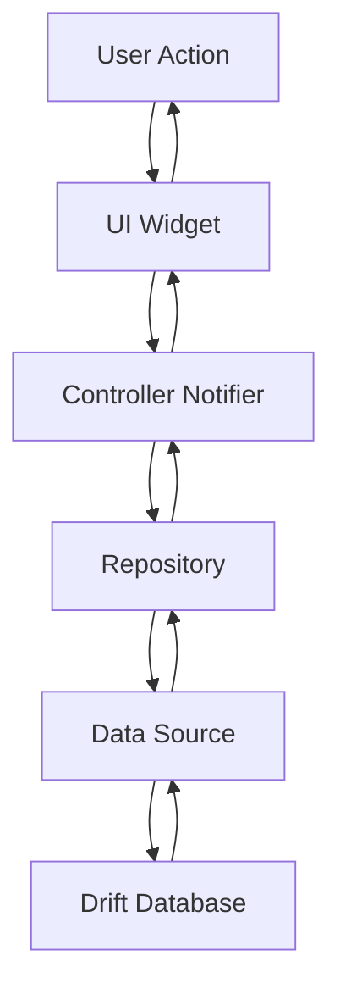

# BizPos-Multi-Venta
# BizPOS - Arquitectura del Proyecto

## 📁 Estructura del Proyecto

```
bizpos/
├── lib/
│   ├── main.dart              # Entry point de la aplicación
│   ├── app.dart               # Configuración principal de MaterialApp
│   ├── bootstrap.dart          # Inicialización de providers
│   ├── core/                   # Código compartido y configuración global
│   │   ├── routing/           # Configuración de rutas
│   │   │   └── app_router.dart
│   │   ├── services/          # Servicios reutilizables
│   │   │   ├── backup_service.dart      # Backup/restore de BD
│   │   │   ├── csv_service.dart         # Import/export CSV
│   │   │   ├── logger_service.dart      # Logging
│   │   │   └── pdf_ticket_service.dart  # Generación de tickets PDF
│   │   └── theme/            # Tema y estilos
│   │       └── app_theme.dart
│   ├── data/                   # Capa de datos
│   │   ├── db/               # Configuración de base de datos
│   │   │   ├── database_provider.dart   # Drift database config
│   │   │   └── db_provider.dart
│   │   └── models/           # Modelos de datos compartidos
│   └── features/              # Módulos de funcionalidades
│       ├── auth/              # Autenticación y usuarios
│       ├── cash/              # Gestión de caja
│       ├── onboarding/        # Configuración inicial
│       ├── pos/               # Punto de venta
│       ├── products/          # Gestión de productos
│       ├── reports/           # Reportes y estadísticas
│       └── settings/          # Configuración general
├── assets/                     # Recursos estáticos
│   ├── icons/
│   │   └── app_icon.ico        # Icono de la aplicación
│   ├── logos/
│   │   └── logo.png           # Logo del negocio
│   └── templates/
├── pubspec.yaml               # Dependencias del proyecto
└── analysis_options.yaml      # Configuración del linter
```

---

## 🏗️ Patrón de Arquitectura

### Clean Architecture con Riverpod

```
┌─────────────────────────────────────────────────────────────┐
│                     PRESENTATION LAYER                      │
│  (Pages, Dialogs, Widgets - flutter_riverpod Widgets)      │
├─────────────────────────────────────────────────────────────┤
│                    CONTROLLER LAYER                         │
│     (Notifiers, StateControllers - State Management)        │
├─────────────────────────────────────────────────────────────┤
│                    REPOSITORY LAYER                         │
│      (Data Access, Abstraction over Data Sources)          │
├─────────────────────────────────────────────────────────────┤
│                   DATA SOURCE LAYER                         │
│    (Database Drift, APIs, Local Storage, File System)      │
└─────────────────────────────────────────────────────────────┘
```

---

## 🔄 Flujo de Datos



---

## 📱 Módulos de Funcionalidades

### 1. Auth Module

```
features/auth/
├── controllers/
│   └── auth_controller.dart      # Estado de autenticación
├── repositories/
│   └── auth_repository.dart       # CRUD de usuarios
├── presentation/
│   └── login_page.dart           # Pantalla de login
└── widgets/
    └── pin_input.dart            # Componente de PIN
```

**Responsabilidades:**

- Login con PIN de 4 dígitos
- Gestión de usuarios (crear, listar, desactivar)
- Roles: Owner, Admin, Employee
- Permisos granulares por usuario

---

### 2. POS Module

```
features/pos/
├── controllers/
│   └── pos_controller.dart       # Estado del carrito
├── repositories/
│   ├── sales_repository.dart     # Ventas y pagos
│   └── void_sale_controller.dart # Anulación de ventas
├── presentation/
│   └── pos_page.dart             # Pantalla principal POS
└── widgets/
    ├── barcode_listener.dart     # Listener de escáner
    ├── return_items_dialog.dart  # Devolución de items
    └── sales_history_dialog.dart # Historial de ventas
```

**Responsabilidades:**

- Carrito de compras
- Escaneo de productos por código de barras
- Pagos mixtos (efectivo + tarjeta)
- Cálculo de vuelto
- Anulación de ventas
- Devolución parcial de items

---

### 3. Products Module

```
features/products/
├── controllers/
│   └── product_controller.dart    # Estado de productos
├── repositories/
│   └── product_repository.dart   # CRUD de productos
├── presentation/
│   └── products_page.dart        # Lista y gestión de productos
└── widgets/
    └── product_form_dialog.dart  # Formulario de producto
```

**Responsabilidades:**

- CRUD de productos
- Gestión de stock
- Búsqueda de productos
- Import/Export CSV

---

### 4. Cash Module

```
features/cash/
├── controllers/
│   ├── cash_session_controller.dart  # Sesión de caja
│   └── cash_movements_controller.dart # Movimientos de caja
├── presentation/
│   └── cash_page.dart                # Gestión de caja
```

**Responsabilidades:**

- Apertura/cierre de caja
- Movimientos de dinero
- Arqueo de caja
- Corte de efectivo

---

### 5. Reports Module

```
features/reports/
├── controllers/
│   └── reports_controller.dart   # Datos de reportes
└── presentation/
    └── reports_page.dart         # Visualización de reportes
```

**Responsabilidades:**

- Reporte de ventas por día
- Ventas por método de pago
- Productos más vendidos
- Ganancias y pérdidas

---

### 6. Settings Module

```
features/settings/
└── presentation/
    └── settings_page.dart        # Configuraciones generales
```

**Responsabilidades:**

- Configuración del negocio
- Ajustes manuales de stock
- Gestión de usuarios
- Backup/restore
- Regeneración de PIN

---

### 7. Onboarding Module

```
features/onboarding/
├── controllers/
│   └── onboarding_controller.dart  # Estado del onboarding
├── repositories/
│   └── onboarding_repository.dart   # Configuración del negocio
├── presentation/
│   └── onboarding_page.dart         # Flujo de configuración inicial
└── widgets/
    ├── step_business_data.dart      # Datos del negocio
    ├── step_owner_setup.dart        # Setup del owner
    └── step_confirmation.dart      # Confirmación final
```

**Responsabilidades:**

- Configuración inicial del negocio
- Creación de usuario owner
- Configuración de impuestos

---

## 💾 Base de Datos (Drift)

### Tablas Principales

```sql
-- Usuarios del sistema
CREATE TABLE users (
  id INTEGER PRIMARY KEY AUTOINCREMENT,
  username TEXT UNIQUE NOT NULL,
  name TEXT,
  pin TEXT NOT NULL,
  role TEXT NOT NULL,  -- 'owner', 'admin', 'employee'
  permissions TEXT,   -- JSON con permisos
  is_active INTEGER DEFAULT 1,
  created_at DATETIME DEFAULT CURRENT_TIMESTAMP
);

-- Productos
CREATE TABLE products (
  id INTEGER PRIMARY KEY AUTOINCREMENT,
  name TEXT NOT NULL,
  code TEXT UNIQUE,
  price REAL NOT NULL,
  cost REAL DEFAULT 0,
  stock REAL DEFAULT 0,
  category TEXT,
  is_active INTEGER DEFAULT 1,
  created_at DATETIME DEFAULT CURRENT_TIMESTAMP
);

-- Ventas
CREATE TABLE sales (
  id INTEGER PRIMARY KEY AUTOINCREMENT,
  user_id INTEGER NOT NULL,
  total REAL NOT NULL,
  discount REAL DEFAULT 0,
  created_at DATETIME DEFAULT CURRENT_TIMESTAMP,
  FOREIGN KEY (user_id) REFERENCES users(id)
);

-- Items de venta
CREATE TABLE sale_items (
  id INTEGER PRIMARY KEY AUTOINCREMENT,
  sale_id INTEGER NOT NULL,
  product_id INTEGER NOT NULL,
  quantity REAL NOT NULL,
  price REAL NOT NULL,
  FOREIGN KEY (sale_id) REFERENCES sales(id),
  FOREIGN KEY (product_id) REFERENCES products(id)
);

-- Pagos
CREATE TABLE payments (
  id INTEGER PRIMARY KEY AUTOINCREMENT,
  sale_id INTEGER NOT NULL,
  method TEXT NOT NULL,  -- 'EFECTIVO', 'DEBITO', 'CREDITO', 'QR', 'TRANSFERENCIA'
  amount REAL NOT NULL,
  cash_received REAL DEFAULT 0,
  cash_change REAL DEFAULT 0,
  FOREIGN KEY (sale_id) REFERENCES sales(id)
);

-- Sesiones de caja
CREATE TABLE cash_sessions (
  id INTEGER PRIMARY KEY AUTOINCREMENT,
  user_id INTEGER NOT NULL,
  opening_amount REAL NOT NULL,
  closing_amount REAL,
  status TEXT DEFAULT 'open',  -- 'open', 'closed'
  opened_at DATETIME DEFAULT CURRENT_TIMESTAMP,
  closed_at DATETIME,
  FOREIGN KEY (user_id) REFERENCES users(id)
);

-- Movimientos de caja
CREATE TABLE cash_movements (
  id INTEGER PRIMARY KEY AUTOINCREMENT,
  session_id INTEGER NOT NULL,
  type TEXT NOT NULL,  -- 'input', 'output'
  amount REAL NOT NULL,
  reason TEXT,
  created_at DATETIME DEFAULT CURRENT_TIMESTAMP,
  FOREIGN KEY (session_id) REFERENCES cash_sessions(id)
);

-- Configuración del negocio
CREATE TABLE business_config (
  id INTEGER PRIMARY KEY,
  name TEXT NOT NULL,
  address TEXT,
  phone TEXT,
  tax_id TEXT,
  tax_rate REAL DEFAULT 0,
  logo_path TEXT,
  currency_symbol TEXT DEFAULT '$'
);

-- Anulaciones
CREATE TABLE void_sales (
  id INTEGER PRIMARY KEY AUTOINCREMENT,
  sale_id INTEGER NOT NULL,
  user_id INTEGER NOT NULL,
  reason TEXT,
  created_at DATETIME DEFAULT CURRENT_TIMESTAMP,
  FOREIGN KEY (sale_id) REFERENCES sales(id),
  FOREIGN KEY (user_id) REFERENCES users(id)
);
```

---

## 🛣️ Navegación (GoRouter)

```mermaid
graph TD
    A[/] --> B[/login]
    A --> C[/onboarding]
    A --> D[/pos]
    D --> E[/pos/products]
    D --> F[/pos/cash]
    D --> G[/pos/reports]
    D --> H[/pos/settings]
```

---

## 🔐 Sistema de Permisos

| Permiso        | Owner | Admin | Employee |
| -------------- | ----- | ----- | -------- |
| Ver reportes   | ✅    | ✅    | ❌       |
| Anular ventas  | ✅    | ✅    | ❌       |
| Ajustar stock  | ✅    | ✅    | ❌       |
| Ver caja       | ✅    | ✅    | ✅       |
| Crear usuarios | ✅    | ❌    | ❌       |
| Configuración  | ✅    | ❌    | ❌       |

---

## 🔧 Servicios Principales

### BackupService

- Backup automático programado
- Restauración de base de datos
- Persistencia en almacenamiento local

### CsvService

- Exportación de productos a CSV
- Importación de productos desde CSV
- Validación de datos

### PdfTicketService

- Generación de tickets de venta
- Soporte para pagos mixtos
- Información detallada de items

---

## 📱 Configuración de Pantallas

### Pantalla Principal (POS)

- **Layout:** NavigationRail + IndexedStack
- **Tab 1:** Productos en grid + Carrito lateral
- **Tab 2:** Gestión de productos
- **Tab 3:** Caja y movimientos
- **Tab 4:** Reportes
- **Tab 5:** Settings
- **Tab 6:** Logout

---

## 🚀 Ejecución del Proyecto

### Desarrollo

```bash
flutter run -d windows
flutter run -d android
flutter run -d chrome
```

### Build Producción

```bash
flutter build windows
flutter build apk --release
flutter build web
```

---

## 📋 Dependencias Principales

```yaml
# State Management
flutter_riverpod: ^2.6.1
riverpod_generator: ^2.6.5

# Navigation
go_router: ^14.8.1

# Database
drift: ^2.28.2
sqlite3_flutter_libs: ^0.5.20

# UI
intl: ^0.19.0
fl_chart: ^0.69.2

# File Operations
path: ^1.9.0
path_provider: ^2.1.3
shared_preferences: ^2.2.3

# PDF
pdf: ^3.10.8
printing: ^5.3.0

# CSV
csv: ^6.0.0
```

---

## ✅ Estado del Proyecto

| Módulo        | Estado               | Observaciones                  |
| ------------- | -------------------- | ------------------------------ |
| Auth          | ✅ Completo          | Login PIN, usuarios, roles     |
| POS           | ✅ Completo          | Carrito, barcode, pagos mixtos |
| Products      | ✅ Completo          | CRUD, stock, CSV               |
| Cash          | ✅ Completo          | Sesiones, movimientos          |
| Reports       | ✅ Completo          | Estadísticas básicas           |
| Settings      | ✅ Completo          | Configuración, backup          |
| Onboarding    | ✅ Completo          | Setup inicial                  |
| Windows Build | ⚠️ Requiere atención | Regenerar archivos C++         |

---

## 📝 Notas de Desarrollo

### Archivos Generados Automáticamente

- `database_provider.g.dart` - Generado por Drift
- `.dart_tool/` - Cache de compilación

### Assets

- `assets/icons/app_icon.ico` - Icono de la aplicación
- `assets/logos/logo.png` - Logo del negocio
- `assets/templates/` - Plantillas CSV

### Configuración Regional

- Moneda: Pesos Argentinos ($)
- Formato de fecha: dd/MM/yyyy
- Decimal separator: coma
